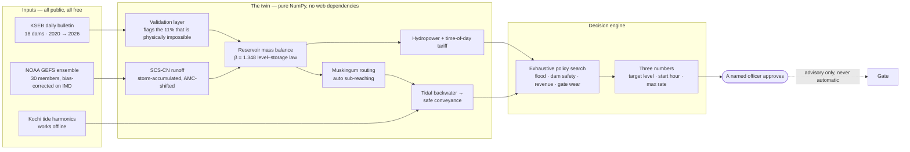
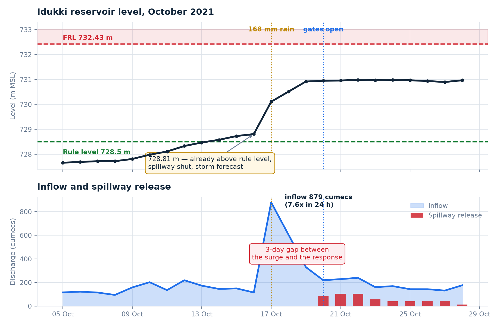
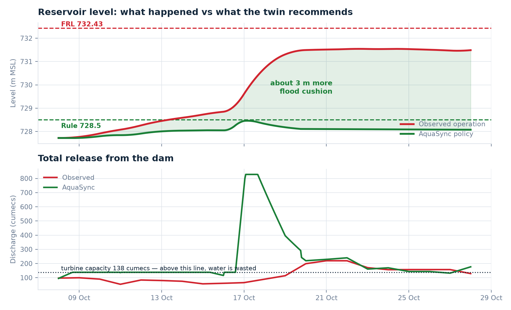
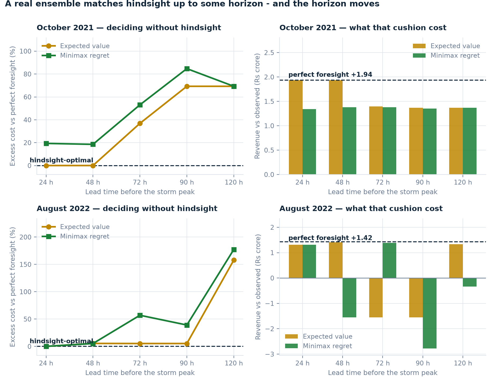
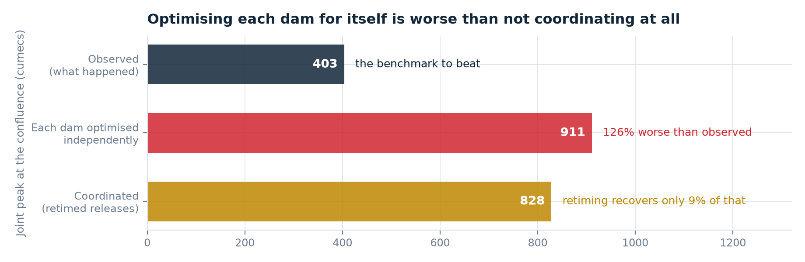

<div align="center">

# 🌊 AquaSync

**A decision-support digital twin for dam–river flood and hydropower
optimisation on the Periyar basin, Kerala.**

[](https://github.com/Am4l-babu/aqua-sync/actions/workflows/ci.yml)
[](backend/pyproject.toml)
[](#licence)
[](docs/data-sources.md)
[](#design-commitments)
[](scripts/)

Built for **EVOKE 26** · Track 2, Climate Resilience & Disaster Preparedness ·
MACE IoT Club, Kothamangalam

</div>

---

## The one-paragraph version

In October 2021 the Idukki reservoir entered a 168 mm rain day already
*above* its own published rule level, with the spillway shut. Inflow rose 7.6×
in twenty-four hours. The gates opened three days later — and Idamalayar, on
the same river, opened its gates on exactly the same day. All of that is in
the public KSEB bulletin. AquaSync simulates that system, replays what
happened to within **0.30 m** of the observed reservoir level, and searches
for the release policy that should have been used instead. The answer is about
**3 m more flood cushion** with *slightly more* generation revenue, not less —
and, tested against a real weather ensemble instead of hindsight, that answer
**survives intact out to 48 hours** before the storm.

## What it does, in one picture



The output is not a dashboard of gauges. It is **three numbers an operator
can act on** — *draw down to this level, starting at this hour, at no more
than this rate* — scored against flood risk, dam safety, revenue and gate wear
together, and handed to a named officer who approves or rejects it. The twin
never operates a gate.

## Results at a glance

Every number regenerates from [`scripts/`](scripts/) and lands in
[`data/processed/`](data/processed/). None is hand-entered.

| | Result | Regenerates from |
|---|---|---|
| Level–storage calibration | β = 1.348, **r² = 0.996**, MAE 17 Mm³ on 1,836 validated rows | `make_figures.py` |
| October 2021 replay | **0.30 m** mean error, 0.57 m max, over 20 days | `out_of_sample_replay.py` |
| August 2022 replay — an episode never tuned to | **0.32 m** mean error | `out_of_sample_replay.py` |
| Flood cushion gained, October 2021 | **About 3 m**, at every lead time from 0 to 30 days | `lead_time_study.py` |
| Revenue effect | **+₹4–10 crore** — positive, by shifting the same generation into higher-tariff hours | `lead_time_study.py` |
| Optimiser's chosen target level | **728.43 m**, against KSEB's published rule level of **728.50 m** | `lead_time_study.py` |
| A real forecast against hindsight | Matches it **to 48 h** (Oct 2021) and **to 90 h** (Aug 2022); then costs +69% and +158% more | `forecast_error_study.py` |
| Two dams optimised separately | Joint peak at the confluence **126% above** what actually happened | `cascade_coordination.py` |
| Rainfall–runoff chain | Volume right (−1% pooled), amplitude not (NSE 0.07) | `runoff_validation.py` |
| River routing calibration | **Blocked**: r² = 0.005 on daily data; CWC's 8 h anchor stands | `routing_calibration.py` |

The target-level line is the one to notice. Given only the physics and the
objective, the optimiser independently rediscovered the operating rule that
already exists, to within 7 cm. The recommendation is not "change the rule" —
the rule is already right. What is missing is a system that acts on it
against a forecast, early enough that acting is cheap.

<table>
<tr>
<td width="50%" valign="top">

<sub><b>Figure 1</b> — October 2021, straight from the public bulletin. Above rule level before the rain; gates open three days after it.</sub>
</td>
<td width="50%" valign="top">

<sub><b>Figure 5</b> — what a policy-based release would have done to the same storm: about 3 m more cushion, slightly more revenue.</sub>
</td>
</tr>
<tr>
<td width="50%" valign="top">

<sub><b>Figure 6</b> — the same decision made on a real ensemble instead of hindsight, October 2021. The August 2022 curve is on the record in <a href="docs/validation.md">validation.md</a> and not yet plotted.</sub>
</td>
<td width="50%" valign="top">

<sub><b>Figure 7</b> — the negative result: optimising each dam for itself is worse than not coordinating at all. Two dams' contribution only; never read against bankfull.</sub>
</td>
</tr>
</table>

## What survives when the forecast is real

The counterfactual hands the optimiser the inflow that actually occurred, so
on its own every benefit figure is a ceiling. The study was therefore re-run
with **real NOAA GEFS 30-member ensembles** issued before each storm,
bias-corrected against IMD gridded rainfall, one policy committed per run, and
scored on the optimiser's own objective as *excess cost against perfect
foresight*. Zero means the forecast picked the policy hindsight would have
picked; the figure can never go below it.

| Lead time before the storm peak | October 2021 | August 2022 |
|---|---|---|
| 24 h | **+0%** | **+0%** |
| 48 h | **+0%** | +5% |
| 72 h | +37% | +5% |
| 90 h | +69% | +5% |
| 120 h | +69% | **+158%** |

Both storms show the same structure — a flat region where a real ensemble is
as good as hindsight, then degradation — but not the same shape. October
ramps from 48 h. August holds to 90 h and then falls off a cliff in a single
30-hour step. **The two are not averaged into one curve**, and they should not
be: August 2022 peaked nearly 5 m below full reservoir level and was the
easier problem. Hedging against the worst ensemble member (minimax regret) is
better than the expected-value rule in exactly one of the ten runs, by 0.16
percentage points, and worse in seven.

Full tables, caveats and reproduce commands: [docs/validation.md §4](docs/validation.md).

## Four claims this project retracted, on the record

A sceptical judge trusts the record of corrections more than the findings.
Every one of these is written up where it was made, not quietly dropped.

| Claim, as first stated | What broke it | Where the retraction lives |
|---|---|---|
| Forecast skill falls off a "cliff" between 24 h and 90 h | Running 48 h and 72 h. It is a ramp | [validation.md §4](docs/validation.md) |
| Hedging (minimax regret) never underperforms expected value | Ten runs: better in one by 0.16 points, worse in seven | [validation.md §4](docs/validation.md), dossier §4.4 |
| A larger bias correction means a worse decision | Lead time correlates at r = 0.93, bias at 0.61; the worst run of all ten has the *smallest* bias factor | [validation.md §4](docs/validation.md) |
| The degradation does not reproduce on the second storm | Written with three of five runs in. The 120 h run reversed it | [HANDOVER.md §6](HANDOVER.md) |

Two defects were found the same way — by checking the artefact instead of
trusting the description. The rainfall–runoff chain charged the curve
number's initial abstraction against every timestep and so produced **no
runoff at all** when driven hourly (168 mm in a day gave 88.97 mm of runoff as
one daily step and 0.00 mm hourly); it is fixed, pinned by a test, and every
forecast-error number was re-run on the fixed chain. And three of the four
BOM tier totals did not match the sum of their own rows.

The rule that came out of it: **treat any conclusion drawn from a partial run
set as provisional until the set is complete.**

## Crisis Commander — be the operator

[`dashboard/crisis.html`](dashboard/crisis.html). You get the duty desk at
Idukki on 8 October 2021 at 727.72 m. You are told what the duty engineer was
told — level now, rain so far, heavy rain forecast — and **not** the inflow
that is coming. You set three numbers. Your order is played forward against
the inflow that actually arrived and scored by **the same optimiser and the
same objective** as everything else, so your result, the operators' result
and AquaSync's sit in one table meaning the same thing.

| Your order | Peak level | Against the day | Revenue |
|---|---|---|---|
| Hoard — 731 m, wait 200 h, 60 cumecs | 732.41 m | **0.87 m less cushion** | −₹21 crore |
| Release early — 727.5 m, start now, 400 cumecs | 728.59 m | **2.95 m more cushion** | **+₹45 crore** |

Early and hard wins on *both* axes. Nearly everyone plays it too late the
first time, which is exactly what the historical record did. The page says
so when the backend is down rather than inventing numbers. It has been
checked end to end functionally and **not yet seen rendered in a browser** —
open it before a demo.

## Quick start

```bash
git clone https://github.com/Am4l-babu/aqua-sync.git && cd aqua-sync
python -m venv .venv && source .venv/Scripts/activate   # Windows Git Bash; .venv/bin/activate elsewhere
pip install -r backend/requirements.txt
git config core.hooksPath .githooks                     # once per clone: runs the fast gate before every commit

python scripts/fetch_data.py                # cache the public dam dataset into data/raw/
python scripts/check.py                     # the single gate: lint, tests, glyphs, regeneration, determinism
python scripts/status.py                    # one-screen status board
```

Reproduce the analyses:

```bash
python scripts/lead_time_study.py           # the central counterfactual, eight lead times
python scripts/out_of_sample_replay.py --scenario idukki_aug_2022
python scripts/runoff_validation.py         # four monsoons of rainfall against inflow
python scripts/cascade_coordination.py      # the two-dam negative result
python scripts/forecast_error_study.py --scenario idukki_aug_2022 --issue-date 2022-08-07 --hh 18 --horizon-h 102
python scripts/make_figures.py              # Figures 1–8 + figure_facts.json
python scripts/build_dossier.py             # the 21-page dossier, byte-identical on rebuild
```

From Python, with `backend/` importable (`pip install -e backend`):

```python
from aquasync.twin.scenarios import run_counterfactual
out = run_counterfactual("periyar_oct_2021")
print(out["summary"]["headline_note"])
```

## Run it live

```bash
uvicorn aquasync.api.main:app --port 8000 --app-dir backend   # from the repo root
```

| URL | What |
|---|---|
| `http://localhost:8000/` | The 3D twin — Three.js, no build step, 1 Hz telemetry with lerp smoothing |
| `http://localhost:8000/crisis.html` | Crisis Commander |

```
GET  /api/health                         GET  /api/crisis/{key}      the briefing
GET  /api/reservoirs                     POST /api/crisis/{key}      score a decision
GET  /api/scenarios                      GET  /api/tide
GET  /api/scenarios/{key}/counterfactual WS   /ws/telemetry
POST /api/whatif
```

The dashboard also opens straight from the filesystem and falls back to a
bundled October 2021 replay when the API is down. The expo venue network is
not a dependency the demo can afford.

## What is here

| Path | What |
|---|---|
| [`backend/aquasync/twin/`](backend/aquasync/twin/) | Simulation and optimisation core — pure NumPy, imports with no web framework installed (CI enforces it) |
| [`backend/aquasync/io/`](backend/aquasync/io/) | Data adapters, with the validation layer that matters (see below) |
| [`backend/aquasync/api/`](backend/aquasync/api/) | FastAPI: REST + telemetry WebSocket, serves the dashboard same-origin |
| [`backend/tests/`](backend/tests/) | 75 physics and behaviour tests — water is conserved, the search is bit-for-bit deterministic, effective rainfall is timestep-invariant |
| [`dashboard/`](dashboard/) | Three.js 3D twin and Crisis Commander — no build step |
| [`firmware/`](firmware/) | ESP32 rig and field nodes (PlatformIO): sensor fusion, safety interlock below the network, hash-chained log |
| [`hardware/`](hardware/) | Four-tier BOM (V1 is ₹6,250) with a shoppable HTML version, pin map, and two wiring traps |
| [`scripts/`](scripts/) | Every analysis, every figure, every document — and `check.py`, the gate |
| [`data/processed/`](data/processed/) | Committed results, so every quoted number can be checked next year |
| [`docs/`](docs/) | Architecture, data sources, validation, and four PDFs that regenerate byte-identically |
| [`research/`](research/) | The deep-research sweep: 144 verified sources, including the five that argue against this project |
| [`reference/source_chats/`](reference/source_chats/) | The original planning material this was built from — including its two errors |

## Key documents

| Document | Read it for |
|---|---|
| [**Project dossier (PDF, 21 pp)**](docs/AquaSync_Project_Dossier.pdf) | The complete case: problem, method, results, the retractions, BOM, limitations, pitch |
| [**Abstract (PDF, 4 pp)**](docs/AquaSync_Abstract.pdf) | The one-sitting version |
| [**Deep research report (PDF, 59 pp)**](docs/AquaSync_Research_Report.pdf) | 144 verified sources and the evidence *against* the thesis |
| [**ICFOSS analysis (PDF, 9 pp)**](docs/AquaSync_ICFOSS_Analysis.pdf) | What Kerala's open-source institute has already built, which of it AquaSync can stand on, and what goes back |
| [PROGRESS.md](PROGRESS.md) | Live status of every component — the single source of truth, on `main` |
| [ACTION_PLAN.md](ACTION_PLAN.md) | The next fourteen days, and the two things that must happen first |
| [ROADMAP.md](ROADMAP.md) | What is next, what is beyond the expo, and what is deliberately *not* being built |
| [HANDOVER.md](HANDOVER.md) | Pick the project up cold in one read |
| [docs/validation.md](docs/validation.md) | Every claim with its error bar, and the explicit list of what is not yet validated |
| [docs/architecture.md](docs/architecture.md) | How the five models fit together and why each was chosen |
| [docs/data-sources.md](docs/data-sources.md) | Every data source, verified — including two corrections to the brief |
| [hardware/bom/](hardware/bom/README.md) | Components, specs, costs, pin map, and a real deployed design to learn from |
| [CLAUDE.md](CLAUDE.md) | Working agreements for AI-assisted work: human contributors only, and how to think here |

## Two things worth knowing before you trust anything here

**The dataset does not contain 2018 data.** This project was planned around
`amith-vp/Kerala-Dam-Water-Levels` as the source of "exactly the 2018 Idukki
data you need". Its historical files begin on **13 August 2020**. The flagship
case study is therefore October 2021 — fully covered, complete, and a better
demonstration. The 2018 flood remains the reason anyone cares, but no
quantitative claim depends on it.

**About 11% of that dataset is corrupt.** Rows between 2020-09-25 and
2021-04-30 report live storage above the reservoir's physical capacity and
storage percentages over 1,000%. Fitting the level–storage curve on the raw
feed gives r² = 0.784; on validated rows, r² = 0.996. The corrupt block alone
displaces the curve by more than the flood cushion being modelled.

```python
from aquasync.io import load_dam
print(load_dam("Idukki").quality_report())
```

Both are documented in full in [docs/data-sources.md](docs/data-sources.md).

## What is still open

Honest limitations, each with its number, in [docs/validation.md](docs/validation.md):

- **AquaSync optimises one reservoir at a time.** Optimising the two dams
  independently makes their shared downstream peak *worse* than what
  happened. The fix is a joint objective, not a bigger timing search — the
  largest open modelling item.
- **Downstream discharge is indicative, not measured.** Routing is anchored
  to CWC's published 8 h travel time; a gauge calibration on daily data
  failed (r² = 0.005) because daily data cannot resolve an 8 h signal.
- **The runoff chain gets storm timing right and storm size wrong** (r² 0.55,
  NSE 0.07). Day-ahead inflow would need a continuous soil-moisture model.
- **The hardware rig is unbuilt** and nothing is ordered. EVOKE is an IoT
  club event; the software is fully demonstrable without the rig, and it
  should not have to be.

Sequencing, and the deliberate no-list, in [ROADMAP.md](ROADMAP.md).

## Design commitments

- **Advisory, permanently.** The system never operates a gate. A named officer
  approves every release. The scale rig does close the loop onto a stepper,
  because it is a 30 cm acrylic tank — and that distinction gets said out loud.
- **Every number regenerates.** No figure is hand-entered. If the upstream
  data changes, the figures and the dossier change with it, and
  `scripts/check.py` fails if a committed document was built from older code.
- **Offline-capable.** Tide prediction, the twin, and the dashboard all run
  with no network. A tool that only works when the internet is up is not a
  disaster-management tool.
- **The simulation core has no framework dependencies.** `twin/` imports
  nothing from `api/`, and CI uninstalls FastAPI to prove it.
- **Retract in public.** A finding that the next data point breaks is
  withdrawn where it was made, with the reason.

## The demo

Six beats, roughly three minutes. Full script in the dossier §12.

1. The rig is already running when they walk up. Point, do not explain.
2. Figure 1 on screen: *"this is real, and it is public."*
3. Dump water in — a live storm. The gate opens **before** FRL.
4. **Flip the sensor-failure switch.** The twin detects the disagreement,
   falls back to mass-balance state estimation, and keeps controlling.
5. Hand over the tablet: *"You are the operator. It is 8 October 2021."*
6. Pull the network cable. Everything keeps running.

Beat 4 is the one that wins the room. Anyone can demo a system working.
Demonstrating a system *failing correctly* is what convinces an engineer it
was built by someone who expected it to be used.

## Licence

MIT for the code. Data belongs to its sources — see
[docs/data-sources.md](docs/data-sources.md) before redistributing anything
under `data/`.
