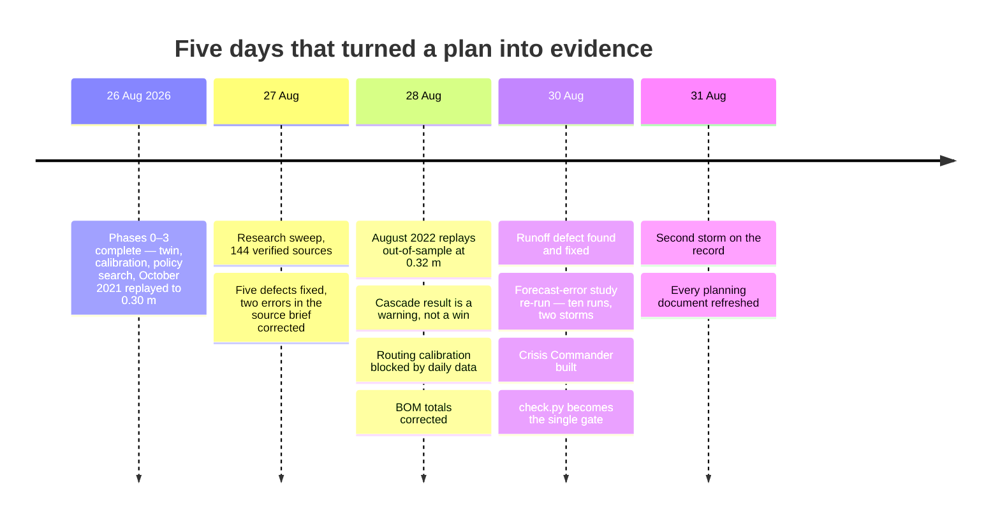
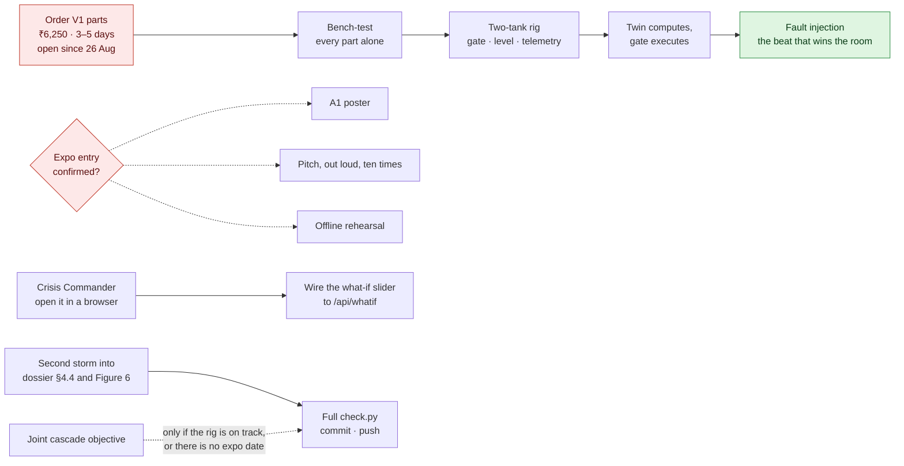

# AquaSync — Roadmap

Sequencing, and — more importantly — what is deliberately **not** being built.

The planning material behind this project accumulated twenty-five candidate
upgrades. Each is individually sound. Attempting more than two produces a
table of half-working prototypes with no time left to rehearse, which is the
most common way a strong idea loses a competition. This document exists to
make the cut explicit and to stop it being relitigated every week.

**As of Monday 31 August 2026.**

---

## How it got here

---

## Phase map

| Phase | Weeks | Deliverable | Done when | Where it stands |
|---|---|---|---|---|
| **0 · Foundation** | 0.5 | Repo, ingestion, validation | Both dams load clean; quality report prints | ✅ 26 Aug |
| **1 · Twin core** | 1.5 | Mass balance, calibration, replay | Observed Oct 2021 level reproduced to < 0.5 m | ✅ 0.30 m, and 0.32 m out-of-sample |
| **2 · Routing & tide** | 1.5 | Muskingum reaches, harmonic tide | Downstream hydrograph with a stated travel time | ✅ anchored to CWC's 8 h; calibration blocked, see item 3 |
| **3 · Decision engine** | 1.5 | Policy search, baseline comparison | A counterfactual with a defensible headline number | ✅ about 3 m, and it holds to 48 h on a real forecast |
| **4 · Hardware rig** | 2 | Two-tank HIL bench | Twin drives the gate; fault injection recovers | 🚫 nothing ordered |
| **5 · Interface** | 1.5 | 3D twin, what-if, Crisis Commander | A stranger can run the demo unaided | 🔄 twin and API built; Crisis Commander built, unseen; what-if unwired |
| **6 · Hardening** | 1 | Tests, docs, rehearsal, poster | Full demo runs with the network cable pulled | 🔄 75 tests and the gate exist; poster and rehearsal not started |

Each phase ends in something demonstrable, so the project is presentable at
any point after Phase 2 rather than only when finished. That is deliberate:
it means a slipped week costs polish, not the demo.

---

## What happens next, and what it waits on

Two of those boxes are red because they are the only two things nobody but
the team can do, and both have been open for days. The fortnight in detail is
in [ACTION_PLAN.md](ACTION_PLAN.md).

---

## In scope, not yet done

Ordered by value per hour. Items that closed keep their entry, because the
*result* is the deliverable and the next reader should not have to dig for
it.

### ✅ 1 · Forecast-error study — ten runs, two storms, 30 Aug 2026

The optimiser sees the **true** inflow when choosing a policy, so every
benefit figure elsewhere is a ceiling. This closes that gap — twice.

**Run:** `python scripts/forecast_error_study.py` once per lead time
(commands in [docs/validation.md §4](docs/validation.md)). A 30-member NOAA
GEFS ensemble issued before the storm, bias-corrected against IMD gridded
rainfall, pushed through the SCS-CN and Muskingum chain, one policy
committed to per member, scored against what actually happened.

**Scored on the optimiser's own objective** — flood, dam safety, revenue and
gate wear together. Zero means the forecast picked the policy hindsight would
have picked, and the figure can never go below it:

| Lead time | Oct 2021 · expected value | Oct 2021 · minimax regret | Aug 2022 · expected value | Aug 2022 · minimax regret |
|---|---|---|---|---|
| 24 h | **+0%** | +19% | **+0%** | +0% |
| 48 h | **+0%** | +19% | **+5%** | +5% |
| 72 h | +37% | +53% | **+5%** | +57% |
| 90 h | +69% | +85% | **+5%** | +39% |
| 120 h | +69% | +69% | **+158%** | +177% |

1. **A real forecast is as good as hindsight out to some horizon, and then it
   is not.** In October 2021 the horizon is 48 h and the degradation is a
   ramp to a +69% plateau. In August 2022 it is 90 h and the degradation is
   a cliff — +158% in a single 30-hour step. The system's value is
   concentrated in the last days before a storm, which is also when a
   control room has least time to think.

2. **Do not average the two storms into one curve.** August 2022 peaked
   nearly 5 m below FRL and was the easier problem (perfect-foresight cost
   0.75 against October's 1.96). Part of why it stays flat for longer is
   plausibly that less was at stake, not that the forecast was better.
   Qualify by reservoir state.

3. **Retracted: "minimax-regret never underperforms expected-value."** Across
   ten runs hedging is better in exactly one — August 48 h, by 0.16
   percentage points — ties in two, and is worse in seven, sometimes heavily
   (August 72 h: +57% hedged against +5%). It buys cushion by over-releasing
   and pays in revenue.

4. **Retracted: "a larger bias correction means a worse decision."** Lead
   time explains October's curve (r = 0.93) and the bias factor does not
   (0.61); the 48 h run carries a 2.73× correction and still matches
   hindsight exactly. The worst run of all ten — August 120 h — has the
   *smallest* bias factor (0.90, the only one below 1).

**Why the numbers here once changed completely.** An earlier version of this
section reported 26–74% retention of the perfect-foresight cushion and
concluded hedging was a safe default. Both came from a rainfall-runoff chain
carrying the defect in item 8 — it charged the curve number's initial
abstraction against every timestep, produced almost no runoff, and so made
every ensemble member look benign. The study was re-run end to end once that
was fixed.

**Do not quote freeboard retention from this study.** Every forecast-driven
policy ends *lower* than the hindsight optimum, so a cushion-only metric reads
above 100% and looks like beating hindsight. It is over-release. The JSON
keeps the old field with a `metric_note` saying so;
`excess_cost_vs_perfect_foresight_pct` is the one to read.

**Still open:** a third storm, ideally a harder one with the reservoir near
FRL, would say whether the horizon tracks reservoir state, lead time, or
something else. And the August numbers are in this file, `PROGRESS.md` and
`validation.md` — **not yet in the dossier's §4.4 or Figure 6**, which is
item 10.

### ✅ 2 · Cascade co-optimisation — first result in, and it is a warning, 28 Aug 2026

Idukki and Idamalayar are optimised independently everywhere else in this
project. The whole evidence base (Figure 2) is that they failed *jointly* —
same river, same day. Scheduling them together so their release pulses do
not superpose looked like the single most valuable modelling addition.

**Run:** `python scripts/cascade_coordination.py`. `RiverNetwork` — a DAG
router already implemented and exported, but never used outside its own
module before this — routes Idukki's release through periyar_upper then
periyar_lower and Idamalayar's directly into periyar_lower at the confluence,
over the October 2021 window (481 hourly steps, both dams).

| Scenario | Joint peak at periyar_lower |
|---|---|
| Observed (what actually happened) | 403 cumecs |
| Each dam optimises alone (existing single-dam tooling, unchanged) | **911 cumecs — 126% worse than observed** |
| Coordinated (timing search over both dams' `start_hour`) | 828 cumecs — 9% better than naive, still 105% worse than observed |

**This is not the finding the section header used to promise, and saying so
plainly is more useful than reframing it.**

1. **Independently optimising each dam is not neutral — it can make the
   shared downstream peak worse than doing nothing coordinated at all.**
   Idukki's own optimum releases at the ceiling of its rate grid (828 cumecs)
   because, evaluated against periyar_lower's 1,100-cumec bankfull threshold
   *alone*, that looks completely safe. It is not safe once Idamalayar's
   simultaneous 314 cumecs is added at the same confluence — a combination
   neither dam's objective function can see, because each scores itself as
   if the shared reach belonged to it.
2. **Retiming alone does not fix it.** The coordination search swept both
   dams' `start_hour` and recovered 9% of the gap it opened. It is an
   objective-function problem: each dam's policy has to be scored against
   the actual *combined* downstream discharge. That is a redesign, not a
   bigger search — item 9.

**Caveat that governs the cumec figures:** these are the two dams'
contribution only. `RiverNetwork.route_all` accepts a `lateral_inflows`
parameter for the ungauged catchment between the dams and Aluva, and it was
not populated — no tributary or local-runoff series exists in this project's
data holdings. **Do not compare these numbers to bankfull or danger
thresholds as if they were total river discharge.** The relative comparison
between the three scenarios is valid; the absolute values are not a
flood-risk verdict.

Method, full numbers and the independent-policy parameters:
`data/processed/cascade_coordination.json`.

### 🚫 3 · Routing calibration against gauges — attempted, blocked by data resolution, 28 Aug 2026

K and x are anchored to CWC's published 8-hour Idukki→Neeleeswaram travel
time — one number from a MIKE-11 model run "only for 2018", not a gauge-pair
calibration.

**Run:** `python scripts/routing_calibration.py`, combined Idukki +
Idamalayar daily release (KSEB bulletin, 2020-08-13 onward) against CWC's
Neeleeswaram daily discharge (1,967-day overlap). `MuskingumReach.calibrate`
ran against real gauge data for the first time.

**Result: the fit failed cleanly, and the failure is itself the finding.**
K = 263 h, x = 0.50 (the search grid's edge), r² = 0.005. The CWC anchor is
unchanged; nothing in `constants.py` was touched. Daily data (dt = 24 h) is
about 3× coarser than the 8-hour signal it would need to resolve. Converting
Neeleeswaram to hourly via the GUARDIAN rating curves already on disk would
not help — the bottleneck is the *release* record (KSEB is daily-only), not
the gauge. The fix is the **CWC 15-minute telemetry feed**, which
`docs/data-sources.md` had already named as the single highest-value upgrade
to the data layer; this is independent, quantified confirmation.

The 2018 gauge gap (Neeleeswaram, 16–27 Aug 2018) is moot for this attempt
— the release record starts in 2020 — but stays on record: the 2018 flood
peak was never gauged there, so any future 2018-specific work is
extrapolation. CAMELS-IND was considered as an alternative route and is not
one: it solves a rainfall–runoff problem, not this routing problem, and
carries no dam releases either.

### 🚫 4 · V1 hardware rig

Blocked on ordering, since 26 August. EVOKE is an **IoT club** event — a
software-only submission will underperform regardless of how good the
modelling is. The BOM is ₹6,250 with live vendor links in
[hardware/bom/bom.html](hardware/bom/bom.html); the build week is planned
day by day in [ACTION_PLAN.md](ACTION_PLAN.md).

### ✅ 5 · Out-of-sample scenario (Aug 2022) — done, 28 Aug 2026

`python scripts/out_of_sample_replay.py --scenario idukki_aug_2022`. Mean
absolute error 0.319 m against October 2021's 0.303 m — within 5% on an
episode never tuned to, which is the "fitted" versus "validated" distinction
this item existed to close. One honest wrinkle: the drift direction flips
between episodes (Oct 2021 ends +0.52 m high, Aug 2022 ends −0.27 m low),
which weakens the single-missing-loss-term explanation in
[validation.md §2](docs/validation.md) and points at event-specific
interpolation timing instead.

### ✅ 6 · Crisis Commander demo mode — built, 30 Aug 2026

[`dashboard/crisis.html`](dashboard/crisis.html), scored by
[`twin/crisis.py`](backend/aquasync/twin/crisis.py) with the same optimiser
and objective as everything else. The duty desk at Idukki on 8 October 2021;
three numbers; your order played forward against the inflow that actually
came. Hoarding (731 m, hour 200, 60 cumecs) ends 0.87 m *short* of the
operators' cushion and ₹21 crore down; releasing early and hard (727.5 m,
hour 0, 400 cumecs) ends 2.95 m *ahead* and ₹45 crore up. The thesis, made
felt.

Logic lives in the twin so the core stays web-free; the hindsight search is
`lru_cache`d per scenario; the page says the backend is down rather than
inventing numbers; 422 on out-of-range, 404 on unknown scenario.

**Not visually verified.** No headless browser on the machine that built it.
Serves, parses, returns correct data — nobody has seen it rendered. Opening
it is the first desk task in the action plan.

### 🔄 7 · FastAPI backend ✅ + live what-if 🔄

The backend exists — eight REST routes and the telemetry WebSocket, serving
the dashboard same-origin, with the heavy calls on `asyncio.to_thread`. The
3D twin's what-if slider works client-side and `POST /api/whatif` works
server-side; **they are not connected**. Wiring them is the only
`🔄 Ongoing` engineering item in [PROGRESS.md](PROGRESS.md).

### ✅ 8 · Rainfall–runoff validation — done, and it found a defect, 30 Aug 2026

The last unvalidated link in the twin, and the one under everything item 1
claims.

**Run:** `python scripts/runoff_validation.py`. No new data was needed — the
KSEB bulletin publishes daily rainfall *and* daily inflow for the same
reservoir, giving four complete monsoon seasons (2021–2024, 722 scored days).

**The first run returned NSE −1.14 at −100% volume bias: the model produced
essentially no runoff at all.** The curve-number equation is an event-total
relation whose initial abstraction is charged once per storm;
`inflow_series` was applying it to every timestep independently. The same
168 mm that fell on 17 October 2021 yielded 88.97 mm of runoff as one daily
step and **0.00 mm** driven hourly. Fixed by accumulating rainfall within a
storm, with storms separated by a rainless gap; effective rainfall is now
identical at 30 min, 1 h, 3 h and 24 h, and
`TestStormExcess::test_excess_is_independent_of_driving_timestep` pins it.
**Item 1 was re-run against the fixed chain.**

With the defect gone the honest scoring is mixed:

| | |
|---|---|
| Pooled volume bias, handbook CN 72 | **−1%** — but per season −7%, −3%, **+38%**, −17% |
| Shape (r²) | 0.55 — rises and falls with the observed hydrograph |
| Amplitude (NSE) | **0.07** — peaks overshoot, and inflow returns to zero between storms |
| Calibrated curve number | Pins at **50, the grid floor**; leave-one-season-out mean NSE −0.02, worst −0.91 |

Calibration was **not adopted** — it buys in-sample fit and pays in volume
bias and generalisation. The handbook 72 stays. The chain is fit for "roughly
how much water, roughly when", not for day-ahead inflow; fixing that is a
continuous soil-moisture model with a recession limb, which is "beyond the
expo" work.

### 📋 9 · Joint cascade objective — the largest open modelling item

Score each dam's policy against the *combined* downstream discharge instead
of its own reach, then repeat item 2's three-way comparison. Item 2 shows
this is an objective-function problem; a bigger timing search will not fix
it. A joint six-parameter grid at the current density is 1,344² combinations
and not tractable, so the design question is which parameters to hold and
which to search. Worth starting only if the rig is on track — or if there is
no expo date, in which case it is worth more than the rig.

### 📋 10 · Put the second storm into the dossier and Figure 6

Dossier §4.4 still says *"a second storm in another monsoon is what would
turn this from a result into a curve worth relying on"* — and that storm has
now been run. `_forecast_error_block` in `scripts/build_dossier.py` and
`fig6` in `scripts/make_figures.py` read the October files only. Qualify,
do not replace: October's "+69% by 90 h" is one storm's curve, August's
90 h figure is +5%. A builder change, so the **full** `check.py` before
pushing.

---

## Explicitly deferred

Not rejected — deferred, with the reason recorded so it is not re-argued.

| Idea | Why deferred |
|---|---|
| **2D inundation (LISFLOOD-FP / HEC-RAS)** | The right long-term answer for street-level depth, and the natural successor to 1D routing. Needs a calibrated DEM and roughness field — a project in itself. Post-expo |
| **Sentinel-1 SAR auto-calibration** | Validates flood *extent* but never *timing*, because the revisit is 6–12 days. Genuinely impressive, but it does not improve a decision made on a 72-hour horizon |
| **Continuous soil-moisture runoff model** | The real fix for the chain's missing recession limb (item 8). A genuine piece of hydrology, not a parameter tweak; the event-based chain is fit for what the twin asks of it today. Post-expo |
| **Graph neural network routing** | Would need years of multi-station training data we do not have. Muskingum with honest error bars beats a GNN trained on 2,000 daily rows |
| **Agent-based evacuation simulation** | Excellent idea, entirely separate project. The twin must first be trusted about water before anyone models people |
| **Reinforcement-learning gate policy** | The policy space here is three parameters and enumerable. RL would add opacity and remove the explainability that makes the recommendation adoptable |
| **Post-quantum SCADA cryptography** | Solving a problem the project does not have yet. Revisit if a utility integration becomes real |
| **Autonomous bathymetry boat** | Real data gap (riverbed geometry shifts each monsoon), genuinely cool, and a three-week build that competes directly with rehearsal time |
| **Thermal seepage / hydrophone leak detection** | Dam *structural* health is a different problem from dam *operation*. Conflating them weakens both stories |
| **Blockchain release ledger** | A SHA-256 hash chain gives the tamper-evidence needed at a fraction of the complexity. Already in the firmware design |
| **WebXR / AR overlay** | Pure spectacle. Considered only if everything else is finished and rehearsed |
| **PINN / learned hydraulic surrogates** | Verified reject. Surrogates pay when the physics model is the bottleneck — hours per run. AquaSync's forward model is a power law plus SCS-CN plus Muskingum, effectively instantaneous, which is the only reason the exhaustive policy search is tractable. PINN accuracy for shallow-water problems is still below conventional solvers. Revisit only if 2D inundation is added |
| **Eclipse Ditto / Azure Digital Twins / NVIDIA Omniverse** | Verified reject, all three. Healthy products aimed at problems this project does not have: device-shadow sync across IoT fleets, a DTDL graph over many-noded assets, GPU physics-ML at CFD scale. AquaSync is two reservoirs and one river. "Digital twin" in the title describes what the model *does*, not a mandate to buy a product with the phrase in its marketing |
| **Google Flood Forecasting API for the hindcast** | Verified reject *for historical work*. India is a supported country and the feed is genuinely useful for live operation, but `queryGaugeForecasts` imposes a hard floor: "Start time cannot be earlier than 2023-10-01". October 2021 is permanently unreachable. Access also needs waitlist approval Google warns "might take several months". Use GRRR instead |
| **Malayalam NLP social sentinel** | Interesting validation signal, but it confirms a flood after it starts — the twin exists to act before |
| **Dam-breach mode** | Different hazard class, different regulatory context. Post-expo |
| **Public deployment on paid infrastructure** | The expo runs offline on a laptop by design. A free-tier public link is optional; paid infrastructure is not happening |

---

## Beyond the expo

| Horizon | Work | Why |
|---|---|---|
| 3–6 months | CWC 15-minute telemetry (unblocks routing calibration); a third storm for the forecast-error curve; the joint cascade objective; 2D inundation; field-deploy one level node — ICFOSS's LoRaWAN radar station is a working reference design | Moves from daily hindcast to operational nowcast, and from one reservoir to the cascade |
| 6–12 months | Shadow-mode trial with KSEB/KSDMA; continuous soil-moisture runoff; Malayalam last-mile alerting via LDMC and Kudumbashree; OGC SensorThings output | Builds the operational trust record adoption requires |
| Beyond | All Kerala cascades; ensemble policies; public tamper-evident release ledger | From one basin to a statewide decision layer |

**Shadow mode is the only realistic adoption path.** No utility will accept an
external recommendation engine on trust. Running alongside real operations for
a full monsoon, logging what it would have advised, and publishing the
comparison is slow, unglamorous, and the only thing that would actually work.

---

## The scope rule

> **Phases 0–3 plus a working V1 rig is a complete, winning project.**

If a new idea arrives, it goes in the deferred table above. It does not go
into the build. The two upgrades already chosen are the **fault-injection
demo** (Phase 4) and the **Crisis Commander mode** (Phase 5, built), and
those are the last two.
